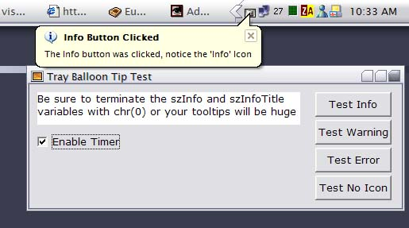



## Systray Balloon Tooltips

### Description

Don't forget to vote. Balloon tooltips in the system tray the way MS does it in 2000/XP/Me. It uses the same method of putting the icon in the tray that we're all used to, but the NOTIFYICONDATA class has changed to reflect the balloon tooltip information. This is the first code i've seen on PSC that does this correctly. Vote if you like it. See the image ->
 
### More Info
 

             |
---                |---
**Submitted On**   |2002-01-13 10:35:10
**By**             |[pt](https://github.com/Planet-Source-Code/PSCIndex/blob/master/ByAuthor/pt.md)
**Level**          |Advanced
**User Rating**    |4.8 (111 globes from 23 users)
**Compatibility**  |VB 5\.0, VB 6\.0
**Category**       |[Windows API Call/ Explanation](https://github.com/Planet-Source-Code/PSCIndex/blob/master/ByCategory/windows-api-call-explanation__1-39.md)
**World**          |[Visual Basic](https://github.com/Planet-Source-Code/PSCIndex/blob/master/ByWorld/visual-basic.md)
**Archive File**   |[Systray\_Ba484411132002\.zip](https://github.com/Planet-Source-Code/pt-systray-balloon-tooltips__1-30762/archive/master.zip)

